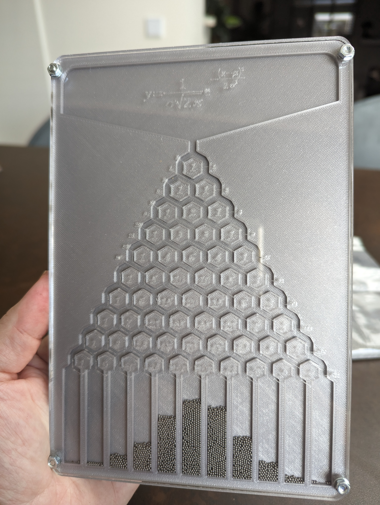

# Quincunx
Design for a Galton board

I designed this using InkScape, then used TinkerCad to make an stl. The top pane was lasercut out of clear acrylic.

Things you need:
- 3D printer
- Laser cutter
- Clear acrylic
- 3 mm nuts & bolts (x4)
- Steel balls with (probably) a diameter of 2 mm.

I used steel balls with a diameter of 1 mm. Unfortunately, these were too small. Because of satic electricity, some of the balls get stuck. So I advice to use larger balls. Currently, I am awaiting an order of 2 mm balls.)

Workflow:
- Import _Quincunx bottom.svg_ (the back panel) and _Quincunx.svg_ (the middle panel with the hexagons) into TinkerCad.
- Set the thickness of both panels. For the middle panel: use the diameter of the balls you are using.
- ALign both panels, then group them.
- Export to an .stl file
- 3D print the .stl file
- Lasercut _Quincunx top.svg_. Black = cut. Red = engrave.

If you like this, you can 

License: [CC BY-NC-SA 4.0](https://creativecommons.org/licenses/by-nc-sa/4.0/)
